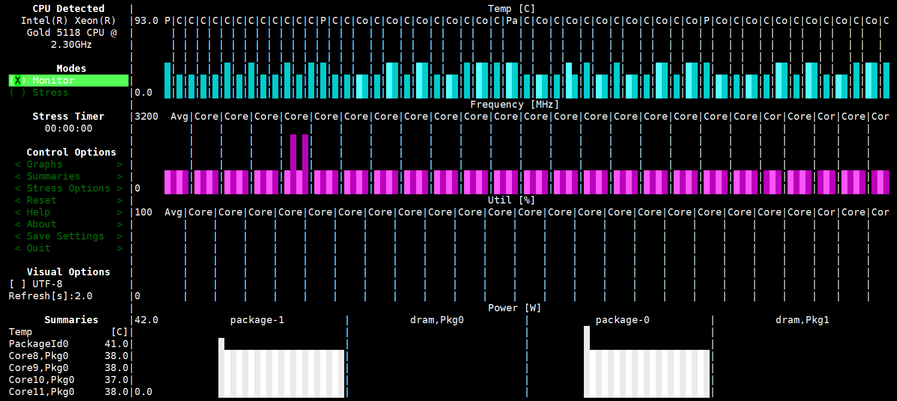

# PCP监控信息 工作进展

     
## 整理能够查看温度和转速的程序，准备在集群上部署。

使用psutil可以获得每个cpu核心的当前温度，最高温度和临界温度,返回的是一个json类型，以及每个风扇的实时转速，返回的是一个list类型。

     psutil.sensors_temperatures() 
     psutil.sensors_fans()
     
lm_sensors 中的sensors可以获取每个cpu的温度信息:

     sensors
     coretemp-isa-0000
     Adapter: ISA adapter
     Package id 0:  +40.0°C  (high = +83.0°C, crit = +93.0°C)
     Core 0:        +39.0°C  (high = +83.0°C, crit = +93.0°C)
     Core 1:        +37.0°C  (high = +83.0°C, crit = +93.0°C)
     Core 2:        +37.0°C  (high = +83.0°C, crit = +93.0°C)
     Core 3:        +38.0°C  (high = +83.0°C, crit = +93.0°C)
     Core 4:        +36.0°C  (high = +83.0°C, crit = +93.0°C)
     Core 5:        +39.0°C  (high = +83.0°C, crit = +93.0°C)
     Core 8:        +38.0°C  (high = +83.0°C, crit = +93.0°C)
     Core 9:        +37.0°C  (high = +83.0°C, crit = +93.0°C)
     Core 10:       +36.0°C  (high = +83.0°C, crit = +93.0°C)
     Core 11:       +37.0°C  (high = +83.0°C, crit = +93.0°C)
     Core 12:       +39.0°C  (high = +83.0°C, crit = +93.0°C)
     Core 13:       +37.0°C  (high = +83.0°C, crit = +93.0°C)

     coretemp-isa-0001
     Adapter: ISA adapter
     Package id 1:  +41.0°C  (high = +83.0°C, crit = +93.0°C)
     Core 0:        +39.0°C  (high = +83.0°C, crit = +93.0°C)
     Core 1:        +38.0°C  (high = +83.0°C, crit = +93.0°C)
     Core 2:        +37.0°C  (high = +83.0°C, crit = +93.0°C)
     Core 3:        +38.0°C  (high = +83.0°C, crit = +93.0°C)
     Core 4:        +40.0°C  (high = +83.0°C, crit = +93.0°C)
     Core 5:        +38.0°C  (high = +83.0°C, crit = +93.0°C)
     Core 8:        +37.0°C  (high = +83.0°C, crit = +93.0°C)
     Core 9:        +37.0°C  (high = +83.0°C, crit = +93.0°C)
     Core 10:       +38.0°C  (high = +83.0°C, crit = +93.0°C)
     Core 11:       +38.0°C  (high = +83.0°C, crit = +93.0°C)
     Core 12:       +39.0°C  (high = +83.0°C, crit = +93.0°C)
     Core 13:       +37.0°C  (high = +83.0°C, crit = +93.0°C)

Stress Terminal UI(s-tui)可以在Linux终端中监控CPU温度，利用率，功耗等信息。运行方法：

     s-tui

## 将监控信息加入到PCP中
     
用psutil.sensors_temperatures() 和psutil.virtual_memory().percent获取cpu温度和memory load，fan speed固定为3600，用s-tui来获取整机功率：

     power_consumption = 0
     var = os.popen("s-tui -j | jq -c '.Power'").read()
     var = json.loads(var)
     for elem in var:
     power_consumption += float(var[elem])

修改pmdasimple.python中的simple_timenow_check函数，为simple.cputemperature，simple.fanspeed和simple.power添加监控信息，包括每个cpu的温度，
整机功耗和风扇转速（固定为3600。
同时修改pmns.save，修改监控信息的名字：

     simple {
         numfetch    SIMPLE:0:0
         color       SIMPLE:0:1
         time
         cputemperature              SIMPLE:2:4
         powerconsumption            SIMPLE:2:5
         fanspeed                    SIMPLE:2:6
     }

     simple.time {
         user        SIMPLE:1:2
         sys         SIMPLE:1:3
     }

安装：

     ./Remove
     ./Install
     
使用方法：

     pmval simple.cputemperature
     pmval simple.fanspeed
     pmval simple.power

## 问题
目前暂时没有获得风扇的转速。
