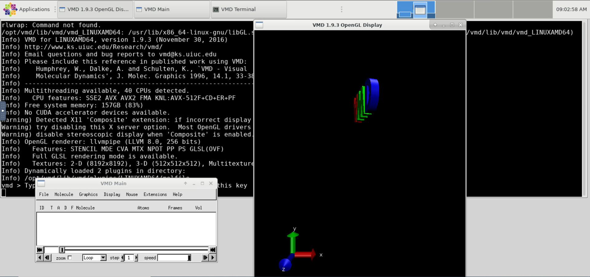

# VMD集成工作

## 工作进展 
获取vmd文件：

    git clone https://github.com/OSC/bc_osc_vmd.git
    
修改submit.yml.erb:

    ---
    batch_connect:
       template: vnc
    script:
       native:
          - "-n"
          - "<%= num_cores.blank? ? 1 : num_cores.to_i %>"

修改form.yml:

    ---
    cluster: "sjtu"
    form:
       - bc_vnc_idle
       - desktop
       - bc_num_hours
       - num_cores
       - node_type
       - bc_account
       - bc_vnc_resolution
       - bc_email_on_started
       - bc_queue
       - version
    attributes:
       desktop: "xfce"
       bc_vnc_idle: 0
       bc_vnc_resolution:
       required: true
    bc_account:
       label: "Project"
        help: "You can leave this blank if **not** in multiple projects."
    node_type: null
    version: "vmd/1.9.4"
    num_cores:
       widget: "number_field"
       label: "Number of cores"
       value: 1
       help: |
         Number of cores on node type (4 GB per core unless requesting whole
         node). Leave blank if requesting full node.
       min: 1
       max: 39
       step: 1
    bc_queue: small

修改template/script.sh.erb,加入语句：

    xfce4-terminal -e "singularity run /lustre/share/img/vmd.simg vmd" -T "VMD Terminal" --disable-server
    
VMD界面：

## 问题

4.28 使用VMD launch，打开可视化界面后，无法连上服务器。可能的解决方法：目前根据文档https://osc.github.io/ood-documentation/release-1.6/enable-desktops/software-requirements.html 参考desktop的部署方式，来部署VMD,参考jupyter/template/script.sh.erb中环境变量的部署方法。

5.1 VMD打开后，进入了xfce的远程桌面，但没有显示vmd的可视化界面。

5.17在vmd的集成中，我使用singularity的vmd镜像来启动vmd，但是目前只能先打开xfce然后再手动输入启动vmd的命令。解决方法：使用xfce4-terminal让xfce在打开时自动执行启动vmd的命令。参考文档：http://manpages.ubuntu.com/manpages/xenial/zh_CN/man1/xfce4-terminal.1.html

   
